# 🛡️ VEILGuard — Vigilant Enterprise Insider Leakage Guard

## 🚨 AI-Powered Insider Threat Detection Platform

VEILGuard is an enterprise-grade cybersecurity platform designed to detect, analyze, and simulate insider threats in real time using Machine Learning, UEBA (User & Entity Behavior Analytics), Rule-Based Detection, and AI-generated SOC analyst reports.

This platform focuses on proactive insider risk detection, privilege misuse monitoring, behavioral anomaly analysis, attack chain simulation, and mitigation recommendation aligned with MITRE ATT&CK principles.

---
# 🏗️ Detection Pipeline Architecture

## VEILGuard Detection Flow

This is the complete architecture flow of VEILGuard — from enterprise log ingestion to AI-powered SOC report generation.

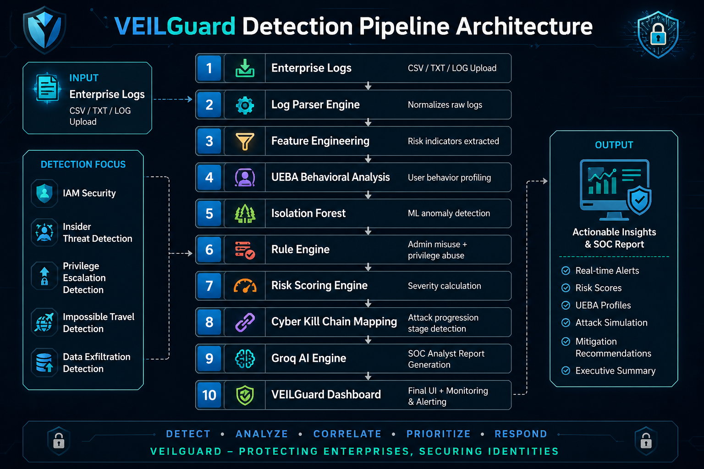

---

# 🔥 Why VEILGuard?

Traditional cybersecurity focuses mostly on external attackers.

However, some of the most dangerous threats come from **inside the organization**:

* Privilege Abuse
* Sensitive File Exfiltration
* Unauthorized Admin Access
* Shadow Admin Accounts
* Impossible Travel Login Patterns
* Suspicious Off-Hours Activity
* Privileged Access Escalation

VEILGuard helps organizations detect and stop these threats before major damage occurs.

---

# ⚙️ Core Features

## 📊 Dashboard Overview

* Real-time threat intelligence monitoring
* Alert severity distribution
* Risk score analytics
* High-risk user ranking
* Device risk analysis
* Threat activity heatmap
* User activity by location

---

## 🚨 Live Monitor & Alerts

* Real-time alert feed
* Critical / High / Medium / Low severity classification
* Cyber Kill Chain progression mapping
* Privilege escalation detection
* Admin misuse detection
* Recommended mitigation actions
* AI-powered SOC Analyst report generation

---

## 👤 User Behavior Profiles (UEBA)

* Individual user/entity risk profiling
* Login hour anomaly heatmap
* Risk progression tracking
* Access location pattern analysis
* Recent suspicious activity log
* Action distribution visualization

---

## ⚡ What-If Simulator

* Attack chain simulation engine
* Privilege escalation modeling
* Lateral movement scenarios
* Persistence planning
* Defense strategy planning
* Proactive threat simulation

---

## 🧪 Synthetic Data Generator

* Enterprise log synthesis engine
* Realistic insider threat dataset generation
* Upload CSV / LOG / TXT files
* Detection engine execution pipeline

---

## 🤖 AI SOC Analyst Reports

Powered using Groq LLM:

* Incident explanation
* Root cause analysis
* Suspicious behavior summary
* Insider threat assessment
* Mitigation recommendations
* Executive-level investigation reports

---

# 🧠 Technologies Used

| Technology   | Purpose                     |
| ------------ | --------------------------- |
| Python       | Core backend                |
| Streamlit    | Dashboard UI                |
| Pandas       | Data engineering            |
| Scikit-learn | Isolation Forest model      |
| Plotly       | Interactive visualizations  |
| Groq LLM     | AI SOC Analyst reporting    |
| Haversine    | Impossible travel detection |
| Rule Engine  | Insider threat logic        |

---

# 🔄 Detection Pipeline Architecture

```text
Enterprise Logs
      ↓
Feature Engineering
      ↓
Behavioral Analysis
      ↓
Isolation Forest Detection
      ↓
Rule-Based Insider Detection
      ↓
Risk Scoring Engine
      ↓
Cyber Kill Chain Mapping
      ↓
Groq AI SOC Report Generation
      ↓
VEILGuard Dashboard
```

---

# 🎯 Resume Impact Statement

Built VEILGuard — an advanced enterprise cybersecurity platform leveraging Streamlit, Isolation Forest anomaly detection, UEBA pipelines, and Groq LLMs to detect insider threats in real time, generate AI-powered SOC analyst reports, simulate malicious insider attack chains, and recommend proactive defensive controls aligned with MITRE ATT&CK.

---

# 🚀 Future Scope

* Active Directory integration
* SIEM integration (Splunk / QRadar)
* Real-time SOC ticket creation
* Email alert automation
* PDF report export
* Threat intelligence feed integration
* MITRE ATT&CK matrix mapping
* Zero Trust access validation

---
---

# 🎥 Project Demo

## 📊 Dashboard Overview

### Dashboard — Section 1
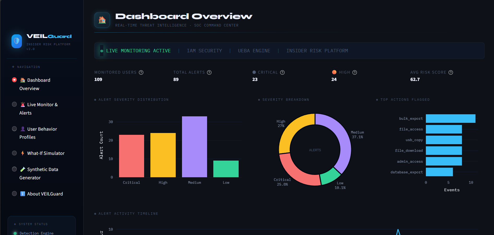

### Dashboard — Section 2
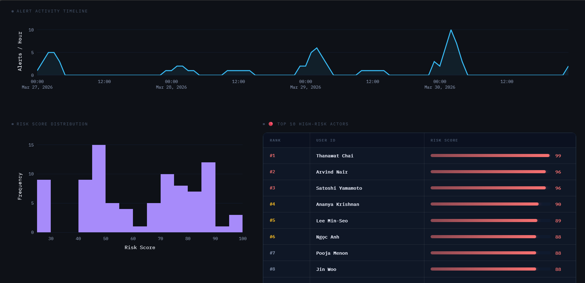

### Dashboard — Section 3
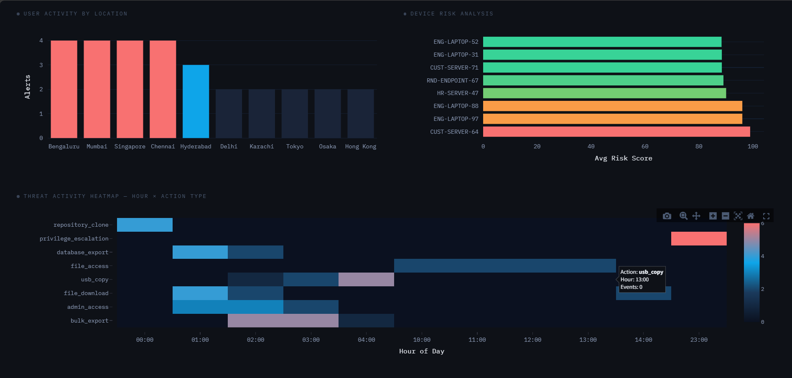

---

## 🚨 Live Monitor & Alerts

### Alerts — Main View
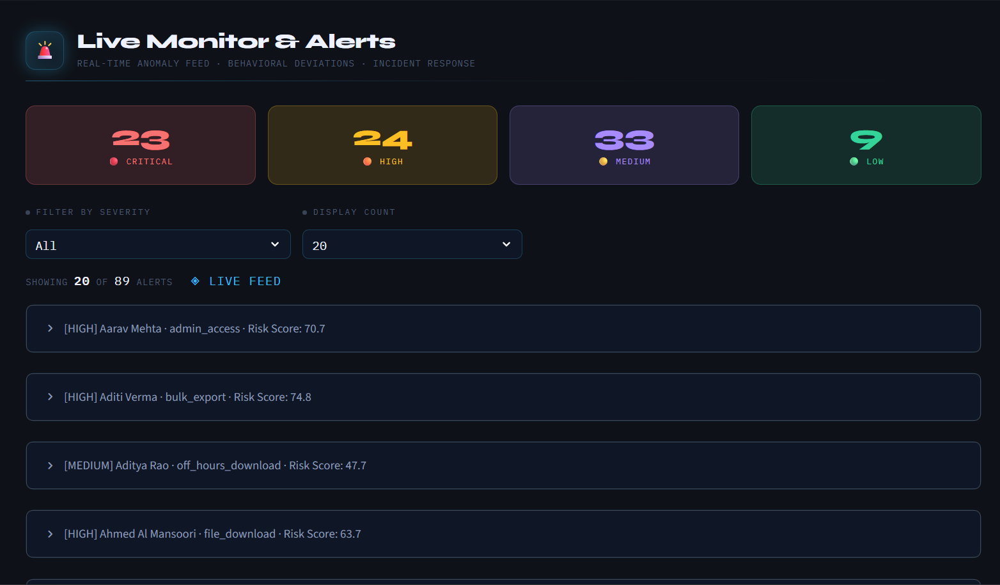

### Alert Investigation Panel
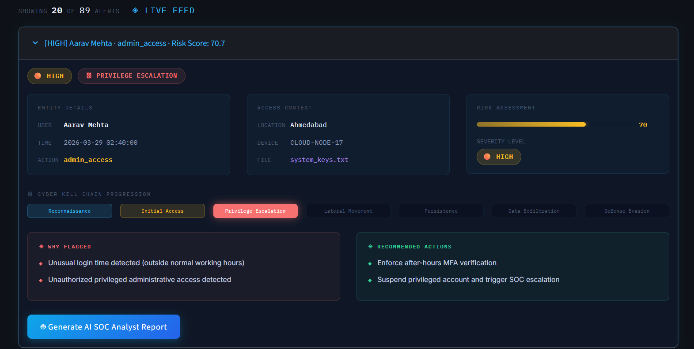


---

## 👤 User Behavior Profiles

### UEBA Profile View
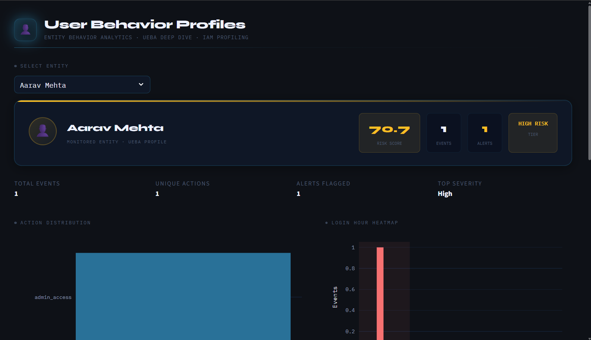

### Risk Progression & Access Pattern
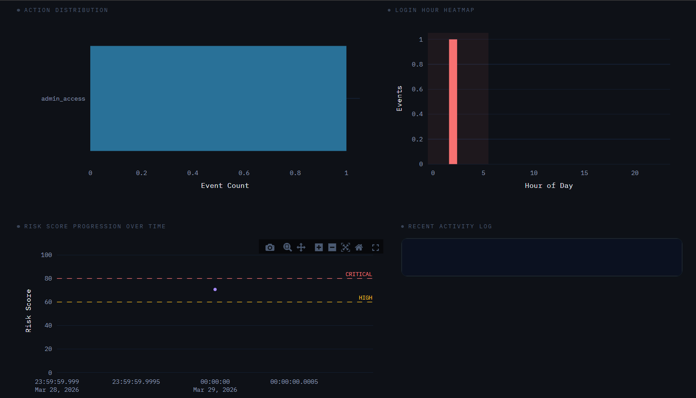
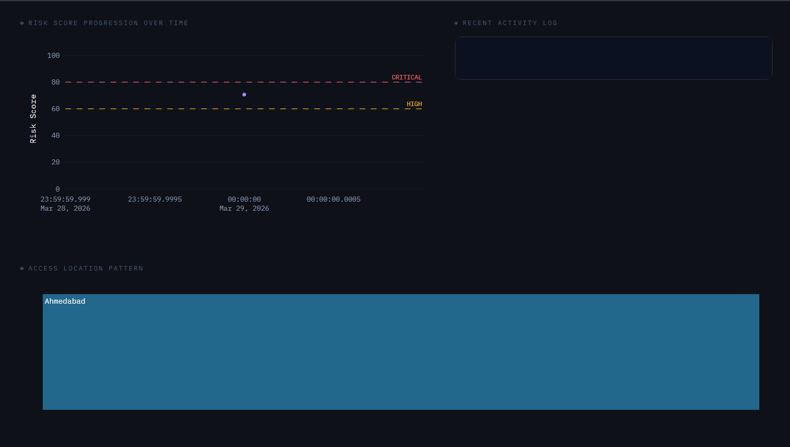

---

## ⚡ What-If Simulator

### Attack Chain Preview
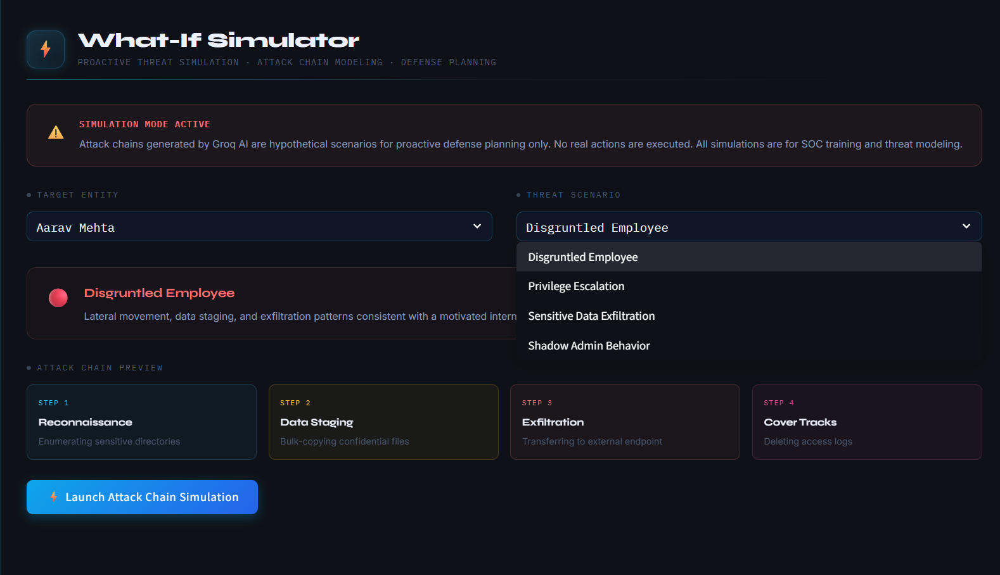


---

## 🧪 Synthetic Data Generator

### Upload & Detection Engine
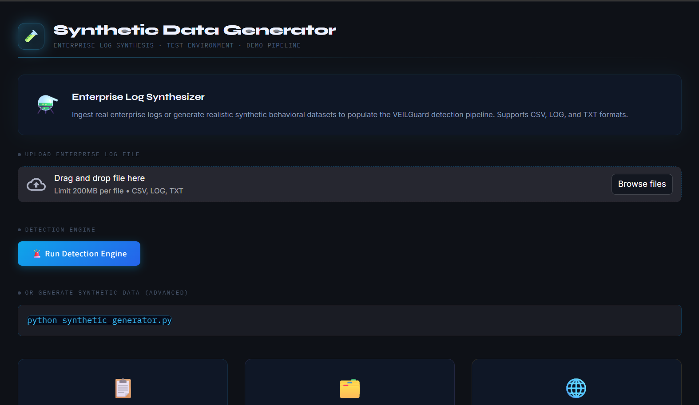

---

## ℹ️ About VEILGuard

### Platform Overview
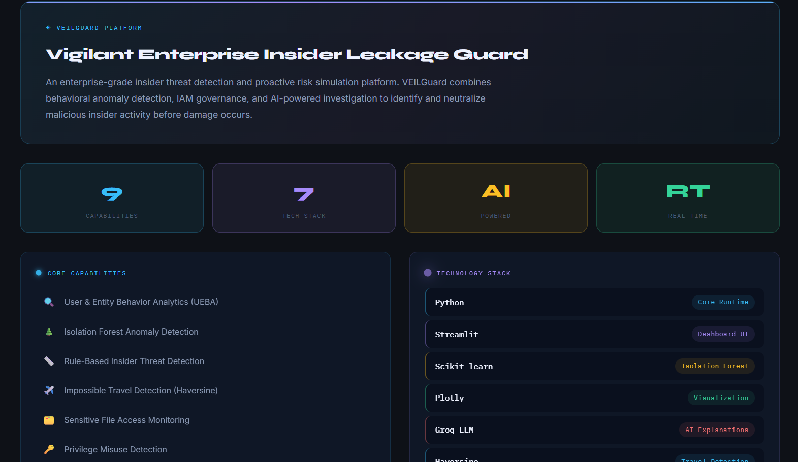

### Detection Pipeline
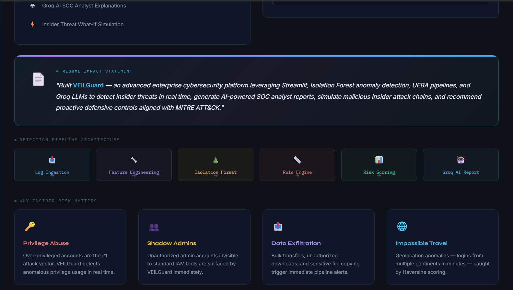

# 📌 Final Year Project + Internship Ready

This project is designed for:

✅ Final Year Major Project
✅ AI in Cybersecurity Internship
✅ SOC Analyst Internship
✅ Cybersecurity Product Portfolio
✅ Resume Shortlisting
✅ Technical Interviews

---

# 👨‍💻 Developed By

Aditya Senapati R
Artificial Intelligence & Machine Learning Engineer

Built with focus on real-world enterprise cybersecurity problem solving.
